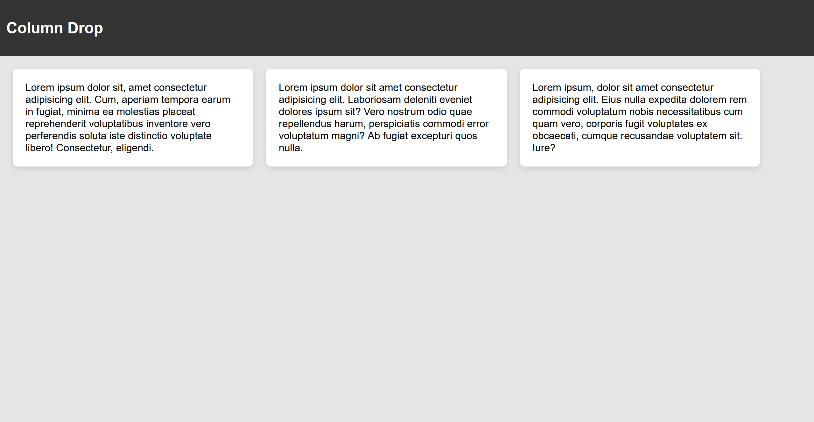
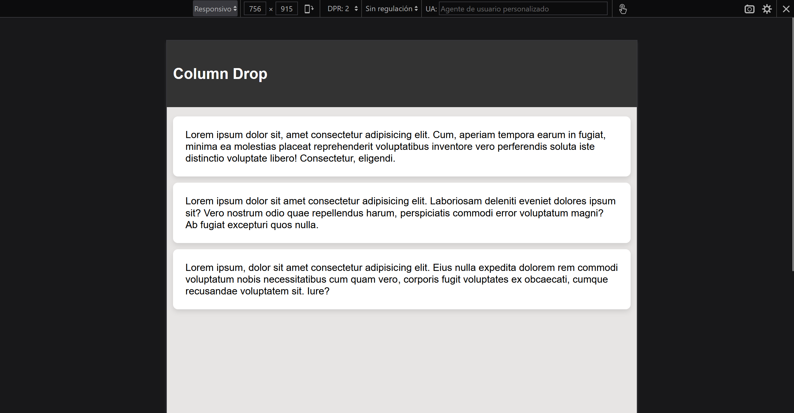
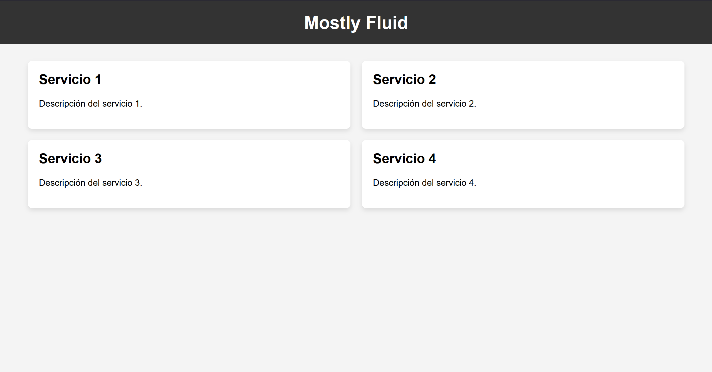
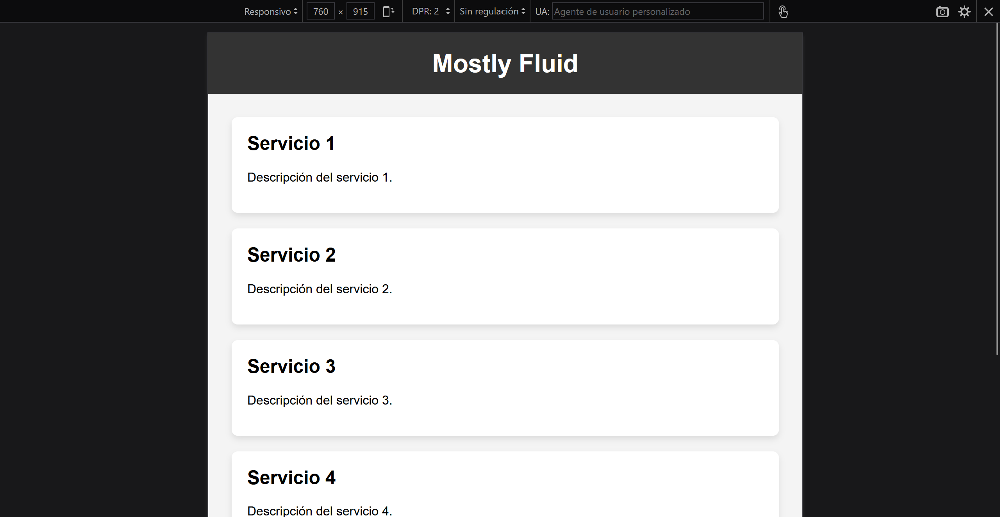
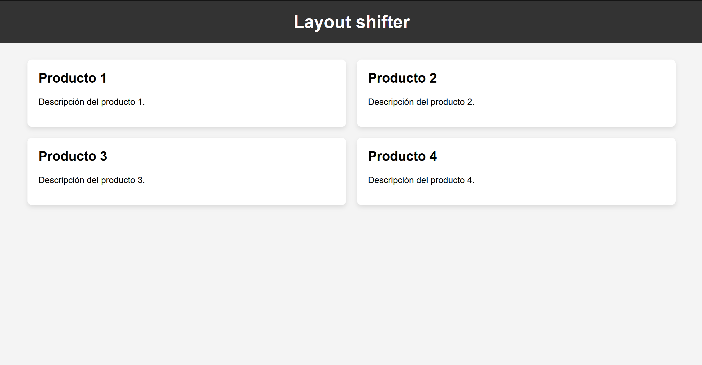
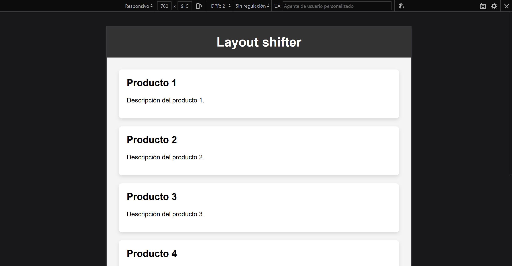

# Patrones de Diseño

Este proyecto trata sobre el patrón de diseño Singleton.

## Proyecto 1

Diseño Column Drop

### Ejemplo

#### Pantallas Grandes

#### Pantallas pequeñas

### Descripción

Este proyecto se implemento el patron de diseño Column Drop para un mock de una pagina informativa con HTML y CSS.

## Proyecto 2

Diseño Mostly Fluid

### Ejemplos

#### Pantallas Grandes

#### Pantallas pequeñas

### Descripción

Este proyecto se implemento el patron de diseño Mostly Fluid para una pagina de servicios en HTML y CSS.

## Proyecto 3

Diseño Layout Shifter

### Ejemplo

#### Pantallas Grandes

#### Pantallas pequeñas

### Descripción

Este proyecto se implemento el patron de diseño Layout Shifter para una pagina de productos con HTML y CSS.
